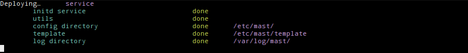

# MAST

**MAST** is a project to setup a Linux service to mount __Multiple Auto-SSH Tunnels__

[TOC]

## Goals

### Unix Service

* monter les tunnel par `autossh` limité individuellement en bande passante par `trickle` ;
* l'ensemble des tunnels `SSH` présent dans les fichiers de conf doivent tous monter au démarrage de la machine sans intervention humaine. ;
* chaque tunnel sera indépendamment, maintenu et logué par le service ;
* chaque tunnel doit pouvoir être monté ou arrêté manuellement ;
* une liste et l'état des tunnel doit être consultable a la demande (service status) ;
* les logs seront séparé par tunnel ;
* le code sera ouvert et documenté. ;
* l'ensemble devra être packagé pour une mise en place facile.

### Web Interface

Dans un second temps il nous faudrait une interface web en 4 pages web:

* liste des sites (basé sur les fichiers de conf) et leur état (en couleur) ;
* ajout / suppression de site-tunnel ;
* liste des imps par site (basé sur les fichiers de conf) ;
* ajout / suppression d'imprimante par site-tunnel ;
* la mise en forme et le style graphique pour ces pages sera réduite au minimum ;
* le code sera ouvert et documenté. ;
* l'ensemble devra être packagé pour une mise en place facile.

## Glossary

* **infrastructure**: a machine that manage the customer's tunnels. Can manage multiple customers ;
* **customer**: company that require our service. Can have one or more _hosts_ ;
* **host**: a machine accessible through Internet by its IP address or FQDN. Can have one or more _tunnels_ ;
* **tunnel**: an SSH's tunnel between our infrastructure and the host's machine. Can have one or more channels (each for a different printer);
* **channel**: a port forwarding configuration from _infrastructure_ to _host_ through a _tunnel_.
## Requirements

* **Debian-based** OS: we are expecting a Debian `6.0+` or Ubuntu-server `12.04+` ;
* GNU `make`: task manager used to install client/server, deploy add others stuff.
* `bash` `≥4.x`: the shell interpreter used for the service ;
* `autoSSH`: to start and monitor ssh tunnels ;
	* `openssh-client`: this is an obvious dependency ;
* `trickle`: user-space bandwidth shaper ;

Except for _make_, all this dependecies can be [checked](#checking-your-system) and [installed](#installing-on-infra) using the makefile, as described below.

## Architecture design: Separation of Concerns

### Service

The core features (_start_, _stop_, _status_, _restart_) are provided through the service file placed in _/etc/mast_

### Administrative Toolbox

All administrative tasks are accomplished through an utility command-line call `mast-utils` placed in _/usr/bin/mast-utils_. A list of available tasks is available in the section [Toolbox's Tasks](#toolboxs-tasks).

### Web Interface

Build on top of both the service and the utility toolbox

## Installation

First, be sure to have _make_ installed on your system:
```bash
apt-get install -y make
```

Then, you must get the project on both the customer's node and your infrastructure:
```bash
wget --output-document="mast.tar.gz" https://github.com/edouard-lopez/mast/archive/master.tar.gz
tar xvzf ./mast.tar.gz && cd mast-master
```
Finally, you can type:
```bash
make install
```
### Using Git

If `git` is installed, you can use it as follow:
```bash
git clone --depth 1 https://github.com/edouard-lopez/mast.git && cd mast
make install
```

## Toolbox's Tasks

A _makefile_ define so-called _tasks_, that allow admin to easily run a complex sequence of commands in a single call. For instance, `make install` might run commands to ① [check the system state](#checking-your-system), ② [install the requirements](#installing-on-infra), ③ [configure everything](#deploying), etc.

It is useful to know that a `make` command can take a series of tasks to accomplish, the previous `make install` task could have been run as `make check-system install-infra deploy`, which is more explicit but a bit longer.

### Tips and Tricks

For administrator familiar with _Bash_'s syntax but unfamiliar with `makefile`'s one, you need to be aware of the following:

* variables can be pass to the makefile script as follow: `make MYVAR=123 taskname` ;
* the `$` (dollar sign) **must be escaped** if you want to have access to bash variable (e.g. ~~$HOME~~ → `$$HOME`) ;
* multi-lines Bash commands should end with a `; \` (semi-column and backslash). Otherwise _make_ will consider each line to be isolated for the surrounding ones ;
* the `@` (at sign) in the begin of a line is use to prevent a command to be printed prior to execution. If you want to see what commands the task really executed, with variables expanded, simply remote the `@`-sign from the beginning of the line :).

### Default Usage (alias)

Aliases to [Usage](#usage).

```bash
sudo make
```

## Channels management

### List Channels
List channels for given host. if none is given, iterate over all hosts.

| Parameter  | Default | Description |
| ------------- | ------------- | ------------- |
| `NAME` | _optional_ | **_string_**. Configuration name. |

```bash
sudo make list-channels
# or
sudo make list-channels NAME=nautilus
```

### Add Channel

Add a new channel for the given printer.

| Parameter  | Default | Description |
| ------------- | ------------- | ------------- |
| `NAME` | **required** | **_string_**. Configuration name. |
| `PRINTER` | **required** | **_string_**. Printer's hostname or ip. |
| `DESC` | _optional_ | **_string_**. Description/comment of the channel. |

Example:
```bash
make add-channel NAME=nautilus PRINTER=1.1.1.1 DESC="Comment blabla"
```


### Remove Channel

Remove a channel using its index position from a given host.

| Parameter  | Default | Description |
| ------------- | ------------- | ------------- |
| `ID` | **required** | **_integer_**. channel index as given by `sudo make list-channels` (cf. [List Channels](#list-channels). |
| `NAME` | **required** | **_string_**. Configuration name. |


For instance, to remove the _second_ channel from the client _nautilus_
```bash
sudo make remove-channel ID=2 NAME=nautilus
```


## Hosts management
### List Hosts
List all hosts available to the service.
```bash
sudo make list-hosts
```


### Add Host

Adding a new host configuration. Both `NAME` **and** `REMOTE_HOST` are required.

| Parameter  | Default | Description |
| ------------- | ------------- | ------------- |
| `NAME` | **required** | **_string_**. Configuration name. |
| `REMOTE_HOST` | **required** | **_string_**. Host IP address or FQDN. |

Example:
```bash
sudo make add-host REMOTE_HOST=1.1.1.1 NAME=nautilus
```


### Remove Host
Remove an host by name. For instance, to remove the _second_ channel from the client _nautilus_

| Parameter  | Default | Description |
| ------------- | ------------- | ------------- |
| `NAME` | **required** | **_string_**. Configuration name. |

```bash
sudo make remove-host NAME=nautilus
```


### Check Privileges

Check files permission.


### Check System
Check system status for dependencies.

After getting the project source code, you can check your system status for requirements using :

```bash
make check-system
```
Once the system is ready for the service, you should get the following output:


## SSH Key
### Create SSH Key (alias)

Aliases to [${SSH_KEYFILE}](#ssh_keyfile).

Create SSH keys pair on infrastructure to allow friction-less connection to the customer's node.

```bash
make create-ssh-key
```


### `${SSH_KEYFILE}`

Aliased by [Create SSH Key](#create-ssh-key-alias).

### Deploy Key

Copy infra public key on customer's node, as defined by `REMOTE_HOST`.

Once the ssh keys are created we need to copy the public key on the (remote) customer's node, in order to leverage authentication mechanism.

**Warning:** must be **run as normal user** to prevent permissions issues.


```bash
make deploy-key
```

If the customer's node address differ from the default value `REMOTE_HOST` (see in the _makefile_), the new value must be passed **as an argument**, as follow:

```bash
make REMOTE_HOST=11.22.33.44 deploy-key
```

### Config SSH (alias)

Aliases to [Deploy Key](#deploy-key).

## Modules Deployment

### Deploy

This is a meta-task that will run the following dependencies:

* depends of [Deploy Service](#deploy-service) ;
* depends of [Deploy Webapp](#deploy-webapp).

### Deploy Service

This task copy project file to their adequate location (_i.e._ `/etc/init.d/`, `/usr/sbin/`)
```bash
sudo make deploy-service
```


### Deploy Webapp
Deploy the webapp, configure and reloading apache, configure _/etc/hosts_

```bash
sudo make deploy-webapp
```


### Install

This is a meta-task that will run the following dependencies:

* [Install project dependencies](#install-infra) ;
* [Check system](#check-system) and [privileges](](#check-privileges)) ;
* [Deploy the service](#deploy-service) ;
* [Create a SSH key pair](#create-ssh-key) if necessary ;
* and [deploy the webapp](#deploy-webapp).

```bash
sudo make install
```


### Install Infra

Install required packages (`autossh`, `trickle`, `openssh-client`, ...) on the infrastructure.

```bash
sudo make setup-infra
```


### Setup Infra (alias)

Aliases to [Install Infra](#instal-infra).

## Helper
### Usage
Display basic help. for further information refer to the [official docs](http//github.com/edouard lopez/mast/readme.md).


### Uninstall

Remove configuration files, services, utility, etc. So you can make a fresh [install](#install).


### List Logs
List all log files, one for each tunnel.
```bash
sudo make list-logs
```


## Service

### Don't kill me, I have kids!

Check if tunnels are children of the service. If this is the case, that means that killing the service will kill **all** tunnels.

## Configuration File

The configuration files used by `mast` are located in the `$CONFIG_DIR` directory as defined in the _makefile_ (default path is `/etc/mast/`).
Those files are dynamically generated using the `make add-host` and use the _template_ file as skeleton. Each configuration describe parameters for a given host and most configuration should not be tampered with.

Below is a list of available parameters and their roles:

| Parameter  | Default | Description |
| ------------- | ------------- | ------------- |
| `RemoteHost` | _HOST_ | **_string_**. [FQDN](https://en.wikipedia.org/wiki/FQDN) or IP address of the customer's node.. |
| `RemoteUser` | _coaxis_ | **_string_**. Unix' username on the customer's node.. |
| `RemotePort` | `22` | **_integer_**. SSH port on the customer's node.. |
| `ServerAliveInterval` | `10` | **_integer_**. Sets a timeout interval in seconds[^manpage-ssh-config] after which if no data has been received from the server, `ssh` will send a message through the encrypted channel to request a response from the server.. |
| `ServerAliveCountMax` | `3` | **_integer_**. Sets the number of server alive messages which may be sent without `ssh` receiving any messages back from the server.[^manpage-ssh-config]. |
| `StrictHostKeyChecking` | _no_ | **_string_**. If this flag is set to _no_, `ssh` will automatically add new host keys to the user known hosts files.[^manpage-ssh-config]. |
| `LocalUser` | _mast_ | **_string_**. The user on the local machine that will be used to create the tunnel.[^js-morisset]. |
| `IdentityFile` | _/home/$LocalUser/.ssh/<br/>id_rsa.mast.coaxis.pub_ | **_string_**. Path to local SSH public key, so we can connect automatically to customer's node.. |
| `ForwardPort` | `"L *:9100:imp1:9100"``"L *:9101:imp2:9100"` | **_array_**.`L [bind_address:]port:host:hostport` Specifies that the given port on the local (client) host is to be forwarded to the given host and port on the remote side.`R [bind_address:]port:host:hostport` Specifies that the given port on the remote (server) host is to be forwarded to the given host and port on the local side.. |
| `BandwidthLimitation` | `true` | **_boolean_**. Flag to toggle  traffic limitation.`true`: enable limitation or `false`: disable.. |
| `UploadLimit` | `1000` | **_integer_**. Upper limit for _upload_ traffic (customer's node is the source of traffic).. |
| `DownloadLimit` |`100` | **_integer_**. Upper limit for _download_ traffic.. |

### References

* [^manpage-ssh-config]: [Manual for OpenSSH SSH **client configuration files**.](http://manpages.ubuntu.com/manpages/precise/en/man5/ssh_config.5.html)
* [^js-morisset]: [Autossh Startup Script for Multiple Tunnels.](http://surniaulula.com/2012/12/10/autossh-startup-script-for-multiple-tunnels/)
* [^manpage-ssh-client]: [Manual for OpenSSH SSH **client**.](http://manpages.ubuntu.com/manpages/precise/en/man1/ssh.1.html)
