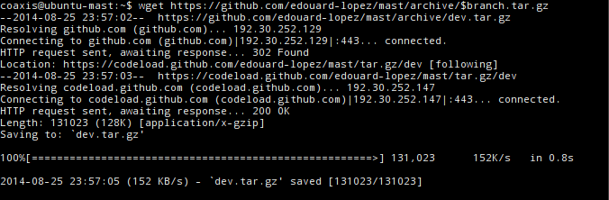
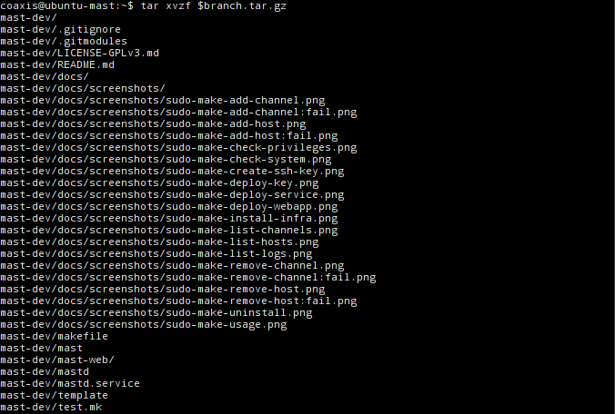

# Step by step Installation

First we need to specify the branch we are working with
```bash
# Development
branch=dev 
# Stable
branch=master
```
### Fetching sources

#### Download sources
Start by fetching sources from official repository and extract them on stable directory (_i.e._ your user's `$HOME`).

```bash
wget https://github.com/edouard-lopez/mast/archive/$branch.tar.gz
```


#### Extract sources
Then extract them with `tar`
```bash
tar xvzf $branch.tar.gz
cd mast-$branch
```


## Installing

We will use the makefile script to install the service and related components:
```bash
sudo make install
```


We can see two errors related to the web UI. If you want to use the web UI, you will have to refer to it's project. Otherwise, you can just ignore both errors.

## Troubleshooting

### _perl: warning: Setting locale failed._

If you got this perl related warning, the actual issue is with SSH and locale forwarding (see below).
```
perl: warning: Setting locale failed.
perl: warning: Please check that your locale settings:
    LANGUAGE = "en_US:en",
    LC_ALL = (unset),
    LC_PAPER = "fr_FR.UTF-8",
    LC_ADDRESS = "fr_FR.UTF-8",
    LC_MONETARY = "fr_FR.UTF-8",
    LC_NUMERIC = "fr_FR.UTF-8",
    LC_TELEPHONE = "fr_FR.UTF-8",
    LC_IDENTIFICATION = "fr_FR.UTF-8",
    LC_MEASUREMENT = "fr_FR.UTF-8",
    LC_TIME = "fr_FR.UTF-8",
    LC_NAME = "fr_FR.UTF-8",
    LANG = "en_US.UTF-8"
    are supported and installed on your system.
perl: warning: Falling back to the standard locale ("C").
```

#### Solution
The solution is to modify the server configuration in order to refuse locale forwarding:

> Stop accepting locale on the server. Do not accept the locale environment variable from your local machine to the server. 
> You can comment out the `AcceptEnv LANG LC_*` line in the remote _/etc/ssh/sshd_config_ file.

The file _/etc/ssh/sshd_config_ should then look like:

```bash
# AcceptEnv LANG LC_*
```
For more information refer to [Locale variables have no effect in remote shell (perl: warning: Setting locale failed.)](http://askubuntu.com/a/144448/22343).

## Screenshots

```bash
screenshotDir="$PWD/docs/screenshots"; height=200; width=675; lineHeight=13;
export n i
function shot() { \
	height=$((${1:-15}*$lineHeight)) ; \
	n=$(printf "%0.2d" $((i++))); \
	fn="$screenshotDir/installation-$n-$task.png"; \
	dimensions=$(($width+1)),$(($height+1)); \
	shutter --output="$fn" \
		--select=1,1,$dimensions \
		--exit_after_capture \
		--no_session; \
	printf "%s: %s" "$n" "$fn"; \
}

```